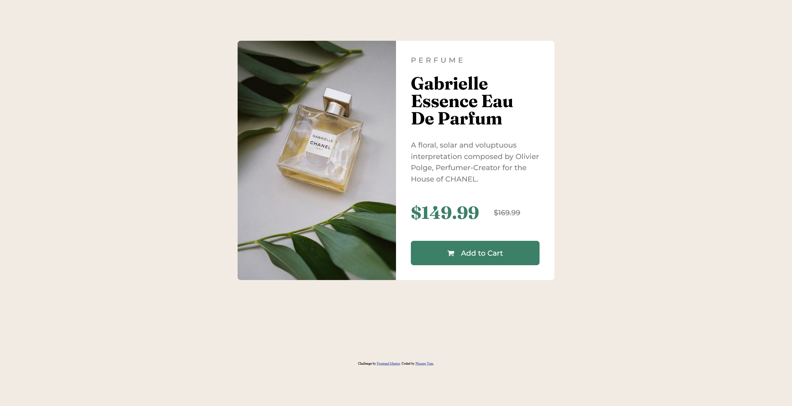

# Frontend Mentor - Product preview card component solution

This is a solution to the [Product preview card component challenge on Frontend Mentor](https://www.frontendmentor.io/challenges/product-preview-card-component-GO7UmttRfa). Frontend Mentor challenges help you improve your coding skills by building realistic projects. 

## Table of contents

- [Overview](#overview)
  - [The challenge](#the-challenge)
  - [Screenshot](#screenshot)
  - [Links](#links)
- [My process](#my-process)
  - [Built with](#built-with)
  - [What I learned](#what-i-learned)
  - [Useful resources](#useful-resources)
- [Author](#author)

**Note: Delete this note and update the table of contents based on what sections you keep.**

## Overview

### The challenge

Users should be able to:

- View the optimal layout depending on their device's screen size
- See hover and focus states for interactive elements

### Screenshot

### Links

- Solution URL: [Solution @Github](https://github.com/pengpongpong/Product-preview-card-component)
- Live Site URL: [Github pages - live preview](https://pengpongpong.github.io/Product-preview-card-component/)

## My process

### Built with

- Semantic HTML5 markup
- CSS custom properties
- Flexbox
- CSS Grid
- Desktop-first workflow
- Sassy CSS (SCSS)

### What I learned

I used "srcset" in image tag for responsive images.

### Useful resources

- [Responsive images](https://developer.mozilla.org/en-US/docs/Learn/HTML/Multimedia_and_embedding/Responsive_images) - It helped me for responsive images and I will use it in the future also.

## Author

- Frontend Mentor - [@pengpongpong](https://www.frontendmentor.io/profile/pengpongpong)
- Github - [@pengpengong](https://github.com/pengpongpong)
